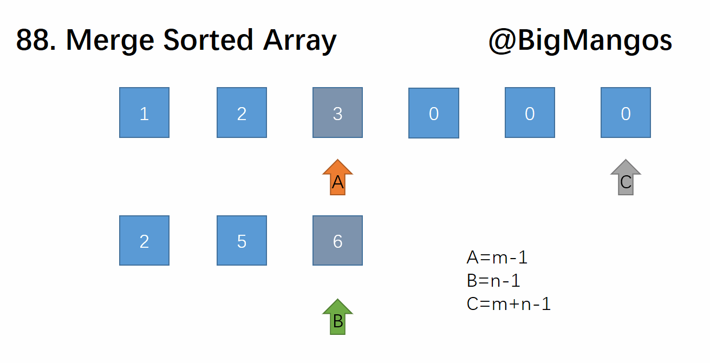

# Merge Sorted Arrays

Este repositório contém uma implementação da solução para o problema de mesclagem de dois arrays inteiros ordenados, `nums1` e `nums2`, em um único array ordenado. A solução é apresentada em Python.

## Problema

Você é fornecido com dois arrays inteiros `nums1` e `nums2`, ordenados em ordem não decrescente, e dois inteiros `m` e `n`, representando o número de elementos em `nums1` e `nums2`, respectivamente. A tarefa é mesclar `nums1` e `nums2` em um único array ordenado. O resultado deve ser armazenado em `nums1`, que tem um comprimento de `m + n`, onde os primeiros `m` elementos são os elementos a serem mesclados, e os últimos `n` elementos são zeros e devem ser ignorados.

### Exemplo

```plaintext
Input: nums1 = [1, 2, 3, 0, 0, 0], m = 3, nums2 = [2, 5, 6], n = 3
Output: [1, 2, 2, 3, 5, 6]
```

## Solução

A solução utiliza uma abordagem de dois ponteiros para mesclar os arrays de trás para frente. A ideia é comparar os elementos de `nums1` e `nums2` e inserir o maior dos dois no final do array `nums1`. Isso é feito para evitar a sobrescrita dos elementos em `nums1` que ainda precisam ser considerados.

### Algoritmo

1. Inicialize três índices:
   - `a` para o último elemento válido em `nums1`.
   - `b` para o último elemento em `nums2`.
   - `c` para o último espaço em `nums1` onde um elemento pode ser escrito.

2. Enquanto houver elementos em `nums2`:
   - Compare os elementos atuais de `nums1` e `nums2`.
   - Coloque o maior na posição `c` de `nums1`.
   - Decrementar os índices apropriados.

3. Continue até que todos os elementos de `nums2` tenham sido mesclados.

## Representação visual



### Código

A implementação da solução está localizada no arquivo `solution.py`.

## Complexidade

- **Complexidade de Tempo**: O(m + n), onde `m` e `n` são os tamanhos dos arrays `nums1` e `nums2`, respectivamente. Cada elemento é processado uma vez.
- **Complexidade de Espaço**: O(1), pois a mesclagem é realizada in-place e não utiliza espaço adicional significativo.

## Testes

Os testes para a implementação estão localizados no arquivo `test.py`. O arquivo contém vários cenários de teste que validam a solução, incluindo casos básicos, arrays vazios e elementos iguais.

### Como Executar os Testes

1. Certifique-se de que você tenha o Python instalado.
2. Navegue até a pasta onde os arquivos estão localizados.
3. Execute o arquivo de teste usando o seguinte comando:

   ```bash
   python test.py
   ```

Se todos os testes forem bem-sucedidos, você verá a mensagem "Todos os testes passaram!". Caso contrário, a mensagem de erro correspondente será exibida.